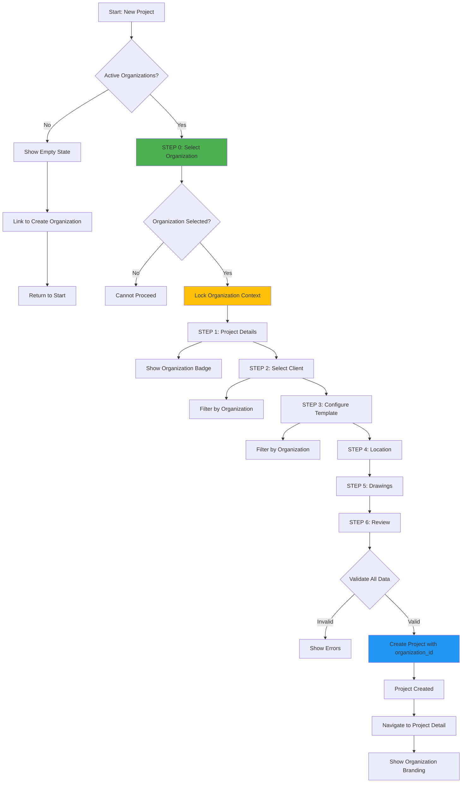

# Organization-First Project Creation Workflow

## Executive Summary

Transform the project creation workflow to prioritize organization selection as the mandatory first step, ensuring all project data, permissions, and reports are properly scoped to the selected organization from the outset.

## Current State Analysis

### Existing Project Wizard Structure
- **6-step wizard**: Project Details → Client → Template → Address → Review → Create
- **Organization selection**: Currently embedded in project details (not prioritized)
- **Issue**: Organization context not established upfront, leading to potential data inconsistency

### Current Data Flow
```
User Opens Wizard
    ↓
Step 1: Enter Project Details (including organization)
    ↓
Step 2-6: Other details
    ↓
Create Project
```

## Target State Design

### New Workflow Structure
**7-step wizard** with organization selection as Step 0 (first step):

```
Step 0: SELECT ORGANIZATION (NEW - MANDATORY FIRST STEP)
    ↓
Step 1: Add Project Details
    ↓
Step 2: Select Client (filtered by organization)
    ↓
Step 3: Configure Templates (filtered by organization)
    ↓
Step 4: Set Location & Address
    ↓
Step 5: Configure Drawings
    ↓
Step 6: Review & Create
```

### Data Flow Architecture

```
┌─────────────────────────────────────────────────────────┐
│ STEP 0: ORGANIZATION SELECTION (GATEWAY)                │
│                                                           │
│ [Select Organization] ──────────────────────────────────┤
│   - Required field                                       │
│   - Must select before proceeding                        │
│   - Organization context established                     │
└────────────────────┬─────────────────────────────────────┘
                     │
                     ▼
        ┌────────────────────────────┐
        │  ORGANIZATION CONTEXT SET  │
        │  - organization_id stored  │
        │  - Branding loaded         │
        │  - Filters activated       │
        └────────────┬───────────────┘
                     │
                     ▼
┌────────────────────────────────────────────────────────┐
│ STEP 1: PROJECT DETAILS                                 │
│ - Organization badge displayed                          │
│ - Organization logo shown                               │
│ - Cannot change organization (locked)                   │
└────────────────────┬───────────────────────────────────┘
                     │
                     ▼
┌────────────────────────────────────────────────────────┐
│ STEP 2: CLIENT SELECTION                                │
│ - Clients filtered by organization_id                   │
│ - Only show organization's clients                      │
│ - Create new client → auto-assign organization         │
└────────────────────┬───────────────────────────────────┘
                     │
                     ▼
┌────────────────────────────────────────────────────────┐
│ STEP 3: TEMPLATE SETUP                                  │
│ - Templates filtered by organization_id                 │
│ - Only show organization's templates                    │
│ - Duplicate from projects → same organization only     │
└────────────────────┬───────────────────────────────────┘
                     │
                     ▼
┌────────────────────────────────────────────────────────┐
│ STEP 4-6: REMAINING DETAILS                             │
│ - All data tagged with organization context            │
│ - Review shows organization branding                    │
│ - Final validation checks organization consistency     │
└────────────────────┬───────────────────────────────────┘
                     │
                     ▼
                ┌────────┐
                │ CREATE │
                │PROJECT │
                └────┬───┘
                     │
                     ▼
        ┌────────────────────────────┐
        │  PROJECT CREATED WITH:     │
        │  - organization_id set     │
        │  - All related data scoped │
        │  - Reports use org branding│
        └────────────────────────────┘
```

## Implementation Plan

### Phase 1: Data Model Updates

#### 1.1 Update WizardData Interface

**File**: `src/components/ProjectWizard.tsx`

**Add organization fields**:
```typescript
export interface WizardData {
  // NEW - Organization (Step 0)
  organizationId: string;
  organizationName: string;
  organizationLogoUrl: string | null;

  // Existing fields
  projectName: string;
  package: string;
  // ... rest of fields
}
```

#### 1.2 Update Database Schema

**Already Complete**: ✅
- `projects.organization_id` column exists (required)
- Foreign key constraint in place
- RLS policies configured

### Phase 2: UI Component Implementation

#### 2.1 Create WizardStep0 - Organization Selection

**New File**: `src/components/wizard/WizardStep0.tsx`

**Features**:
- Large, prominent organization selector
- Visual cards showing organization logo and details
- Search/filter functionality
- "Cannot proceed without selection" message
- Link to create new organization if needed

**Component Structure**:
```tsx
<WizardStep0>
  <Header>Select Your Organization</Header>
  <Description>
    Choose the organization for this project.
    All project data and reports will use this organization's branding.
  </Description>

  {loading && <Spinner />}

  {organizations.length === 0 && (
    <EmptyState>
      No active organizations found.
      <Link to="/settings/organizations">Create Organization</Link>
    </EmptyState>
  )}

  {organizations.length > 0 && (
    <OrganizationGrid>
      {organizations.map(org => (
        <OrganizationCard
          key={org.id}
          organization={org}
          selected={wizardData.organizationId === org.id}
          onClick={() => selectOrganization(org)}
        />
      ))}
    </OrganizationGrid>
  )}

  <ValidationMessage>
    ⚠️ Organization cannot be changed after project creation
  </ValidationMessage>
</WizardStep0>
```

#### 2.2 Update Existing Wizard Steps

**WizardStep1.tsx** (Project Details):
- Add organization context display banner at top
- Show selected organization logo and name (read-only)
- Visual indicator that organization is locked

**WizardStep2.tsx** (Client Selection):
- Filter clients by `wizardData.organizationId`
- When creating new client, auto-set organization_id
- Show count: "Showing X clients from [Organization Name]"

**WizardStep3.tsx** (Template Setup):
- Filter templates by organization_id
- Filter source projects by organization_id
- Prevent cross-organization duplication

**WizardStep4-6**:
- Maintain organization context display
- All data inherits organization_id

#### 2.3 Update ProjectWizard Component

**Changes**:
```typescript
// Update total steps from 6 to 7
const TOTAL_STEPS = 7;

// Update step rendering
const renderStep = () => {
  switch (currentStep) {
    case 0:
      return <WizardStep0 data={wizardData} updateData={updateData} />;
    case 1:
      return <WizardStep1 data={wizardData} updateData={updateData} />;
    // ... rest renumbered
  }
};

// Update canProceed validation
const canProceed = () => {
  switch (currentStep) {
    case 0:
      return wizardData.organizationId !== '';
    case 1:
      return wizardData.projectName.trim() !== '';
    // ... rest
  }
};

// Update progress indicator
<ProgressBar>
  Step {currentStep + 1} of {TOTAL_STEPS}
</ProgressBar>
```

### Phase 3: Data Propagation Mechanisms

#### 3.1 Organization Context Provider (Optional Enhancement)

**File**: `src/contexts/OrganizationContext.tsx`

```typescript
interface OrganizationContextType {
  currentOrganization: Organization | null;
  setCurrentOrganization: (org: Organization) => void;
  clearOrganization: () => void;
}

export function OrganizationProvider({ children }) {
  const [currentOrganization, setCurrentOrganization] = useState<Organization | null>(null);

  // Provide organization context to all child components
  return (
    <OrganizationContext.Provider value={{
      currentOrganization,
      setCurrentOrganization,
      clearOrganization: () => setCurrentOrganization(null)
    }}>
      {children}
    </OrganizationContext.Provider>
  );
}
```

#### 3.2 Automatic Data Scoping

**Query Modifications**:

```typescript
// Client Selection - Auto-filter by organization
const loadClients = async (organizationId: string) => {
  const { data } = await supabase
    .from('clients')
    .select('*')
    .eq('organization_id', organizationId)  // AUTO-FILTER
    .order('name');
  return data;
};

// Template Selection - Auto-filter by organization
const loadTemplates = async (organizationId: string) => {
  const { data } = await supabase
    .from('project_templates')
    .select('*')
    .eq('organization_id', organizationId)  // AUTO-FILTER
    .order('name');
  return data;
};

// Source Projects - Auto-filter by organization
const loadSourceProjects = async (organizationId: string) => {
  const { data } = await supabase
    .from('projects')
    .select('id, name')
    .eq('organization_id', organizationId)  // AUTO-FILTER
    .order('created_at', { ascending: false });
  return data;
};
```

#### 3.3 Project Creation with Organization

**Update final submission**:
```typescript
const createProject = async () => {
  const { data, error } = await supabase
    .from('projects')
    .insert({
      name: wizardData.projectName,
      organization_id: wizardData.organizationId,  // CRITICAL FIELD
      client_id: wizardData.clientId,
      // ... other fields
    })
    .select()
    .single();

  if (error) throw error;
  return data;
};
```

### Phase 4: System-Wide Consistency

#### 4.1 Components Requiring Organization Context

**List of Components to Update**:

1. **ProjectWizard** ✅ (Primary implementation)
   - Step 0: Organization selection
   - All steps: Organization display

2. **CreateProjectModal** ✅ (Already updated)
   - Organization selector
   - Quick create flow

3. **ProjectDetail** (Enhancement)
   - Display organization badge
   - Show organization logo
   - Link to organization settings

4. **Report Generators** ✅ (Already updated via RPC)
   - Introduction
   - Executive Summary
   - Complete Report
   - All exports

5. **Client Management**
   - Filter clients by organization
   - Create client with organization

6. **Template Management**
   - Filter templates by organization
   - Create template with organization

7. **Site Manager**
   - Inherit organization from project
   - Show organization context

8. **Dashboard**
   - Group projects by organization
   - Organization-level statistics

#### 4.2 Data Validation Rules

**Validation Layer**:

```typescript
// Validation utility
export const validateOrganizationConsistency = async (projectId: string) => {
  const checks = [];

  // 1. Project has organization
  const project = await getProject(projectId);
  checks.push({
    rule: 'project_has_organization',
    passed: !!project.organization_id,
    message: 'Project must have an organization'
  });

  // 2. Client matches project organization (if client exists)
  if (project.client_id) {
    const client = await getClient(project.client_id);
    checks.push({
      rule: 'client_organization_match',
      passed: client.organization_id === project.organization_id,
      message: 'Client must belong to same organization as project'
    });
  }

  // 3. Members created from project have matching organization
  const members = await getProjectMembers(projectId);
  const allMembersMatch = members.every(m =>
    m.organization_id === project.organization_id
  );
  checks.push({
    rule: 'members_organization_match',
    passed: allMembersMatch,
    message: 'All project members must belong to project organization'
  });

  // 4. Documents/drawings inherit organization
  const documents = await getProjectDocuments(projectId);
  const allDocsMatch = documents.every(d =>
    d.organization_id === project.organization_id
  );
  checks.push({
    rule: 'documents_organization_match',
    passed: allDocsMatch,
    message: 'All project documents must belong to project organization'
  });

  return {
    allPassed: checks.every(c => c.passed),
    checks
  };
};
```

**Database Constraints**:

```sql
-- Add to migration (if needed)

-- Ensure clients have organization (if table has org field)
ALTER TABLE clients
  ADD COLUMN IF NOT EXISTS organization_id uuid REFERENCES organizations(id);

-- Ensure templates have organization
ALTER TABLE project_templates
  ADD COLUMN IF NOT EXISTS organization_id uuid REFERENCES organizations(id);

-- Add check constraints
ALTER TABLE projects
  ADD CONSTRAINT check_organization_not_null
  CHECK (organization_id IS NOT NULL);
```

#### 4.3 RLS Policy Updates

**Ensure organization-based filtering**:

```sql
-- Projects: Users can only see projects from their organization(s)
-- (Optional - if implementing organization-based user permissions)
CREATE POLICY "Users can view organization projects"
  ON projects FOR SELECT
  TO authenticated
  USING (
    organization_id IN (
      SELECT organization_id
      FROM user_organizations
      WHERE user_id = auth.uid()
    )
  );
```

### Phase 5: User Experience Enhancements

#### 5.1 Visual Design

**Organization Selection Step**:
- **Large cards** with organization logos
- **Color coding** for different organizations
- **Hover effects** to show selection
- **Selected state** clearly highlighted
- **Empty state** with helpful guidance

**Organization Context Display**:
- **Sticky header** showing selected organization
- **Badge/pill** format for organization name
- **Small logo** next to organization name
- **Tooltip** on hover showing full organization details

#### 5.2 Informational Messaging

**Step 0 - Organization Selection**:
```
🏢 Select Your Organization

Choose the organization for this project. This determines:
• Which clients and templates are available
• What branding appears on reports
• How project data is organized

⚠️ Important: Organization cannot be changed after project creation
```

**Step 1 - Project Details**:
```
📌 Project Organization: [Organization Name] [Logo]

This project belongs to [Organization Name]. All reports will use
this organization's branding and contact information.

Need to change organization? Go back to Step 1.
```

#### 5.3 Navigation Controls

**Back Button Behavior**:
- From Step 1 → Back to Step 0 (can change organization)
- Warning if data entered: "Going back will let you change the organization"

**Exit Confirmation**:
- "Are you sure? Your progress will be saved."
- Draft saved in sessionStorage

### Phase 6: Testing & Validation

#### 6.1 Unit Tests

**Organization Selection**:
- ✓ Loads active organizations
- ✓ Prevents proceeding without selection
- ✓ Saves organization to wizard data
- ✓ Handles zero organizations gracefully

**Data Propagation**:
- ✓ Client list filtered by organization
- ✓ Template list filtered by organization
- ✓ Project created with correct organization_id

**Validation**:
- ✓ Cannot create project without organization
- ✓ Cannot mix organizations (client from org A, project in org B)

#### 6.2 Integration Tests

**End-to-End Workflow**:
1. Open project wizard
2. Select organization
3. Complete all steps
4. Create project
5. Verify project.organization_id matches
6. Generate report
7. Verify report shows correct organization branding

#### 6.3 Edge Cases

**No Organizations**:
- Show empty state
- Provide link to create organization
- Disable project creation

**Single Organization**:
- Auto-select if only one active organization
- Still show selection step for clarity
- Allow proceeding immediately

**User Changes Mind**:
- Can go back from Step 1 to Step 0
- Warning about data consistency
- Clear subsequent step data if organization changed

### Phase 7: Documentation

#### 7.1 Workflow Diagram



#### 7.2 Technical Specifications

**Document**: `ORGANIZATION_WORKFLOW_TECHNICAL_SPEC.md`

**Contents**:
- Data model schema
- API endpoints
- Component interfaces
- Validation rules
- Error handling
- Performance considerations

#### 7.3 User Guide

**Document**: `ORGANIZATION_FIRST_WORKFLOW_USER_GUIDE.md`

**Contents**:
- Step-by-step walkthrough
- Screenshots of each step
- Common scenarios
- Troubleshooting
- FAQs

## Implementation Timeline

### Week 1: Foundation
- Day 1-2: Update data models and interfaces
- Day 3-4: Create WizardStep0 component
- Day 5: Update ProjectWizard component

### Week 2: Integration
- Day 1-2: Update existing wizard steps
- Day 3-4: Implement data propagation
- Day 5: Add validation rules

### Week 3: Polish & Testing
- Day 1-2: UI/UX refinements
- Day 3-4: Comprehensive testing
- Day 5: Documentation

## Success Metrics

### Quantitative
- ✅ 100% of projects have organization_id
- ✅ 0% organization mismatch errors
- ✅ <2 seconds to load organization selection
- ✅ >95% of users proceed past organization selection

### Qualitative
- ✅ Users understand organization importance
- ✅ Clear visual hierarchy
- ✅ Intuitive workflow
- ✅ No confusion about organization selection

## Risk Mitigation

### Risk: Users Skip Organization Selection
**Mitigation**: Make it mandatory first step, cannot proceed without it

### Risk: Organization Data Inconsistency
**Mitigation**: Automated validation checks, database constraints

### Risk: Poor User Experience
**Mitigation**: Clear messaging, visual design, helpful guidance

### Risk: Performance Degradation
**Mitigation**: Efficient queries, indexed organization_id columns

## Rollout Plan

### Phase 1: Development (Week 1-3)
- Implement all features
- Internal testing

### Phase 2: Staging (Week 4)
- Deploy to staging environment
- User acceptance testing
- Gather feedback

### Phase 3: Production (Week 5)
- Deploy to production
- Monitor usage
- Provide support

### Phase 4: Post-Launch (Week 6+)
- Analyze metrics
- Collect user feedback
- Iterate improvements

---

**Status**: Ready for implementation
**Priority**: High
**Complexity**: Medium
**Estimated Effort**: 3 weeks

This organization-first workflow ensures data consistency, proper scoping, and automatic branding propagation throughout the entire project lifecycle.
